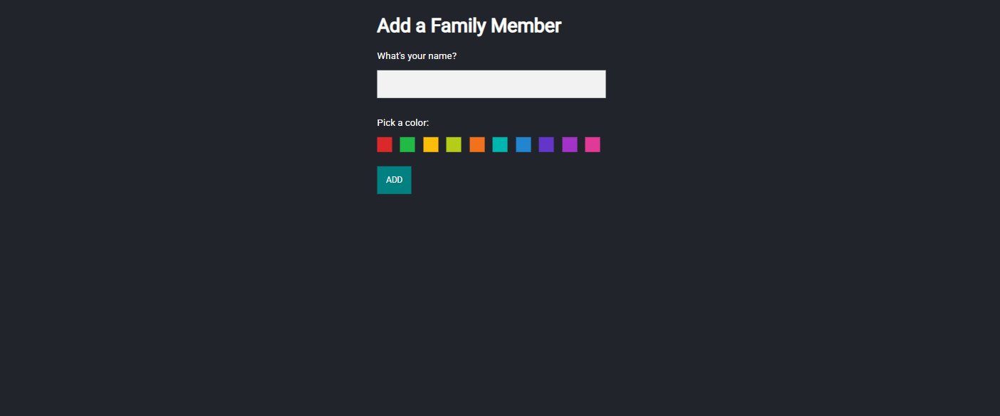
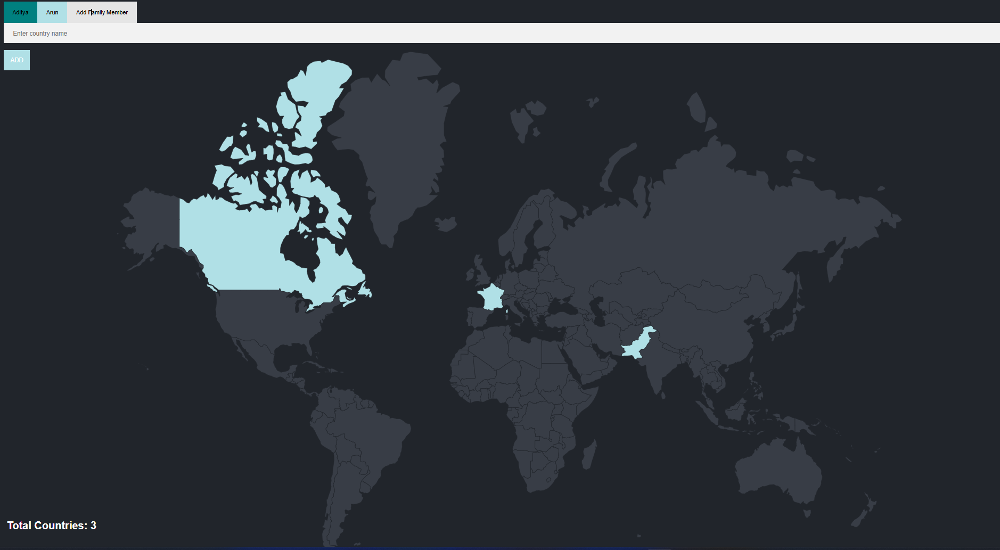
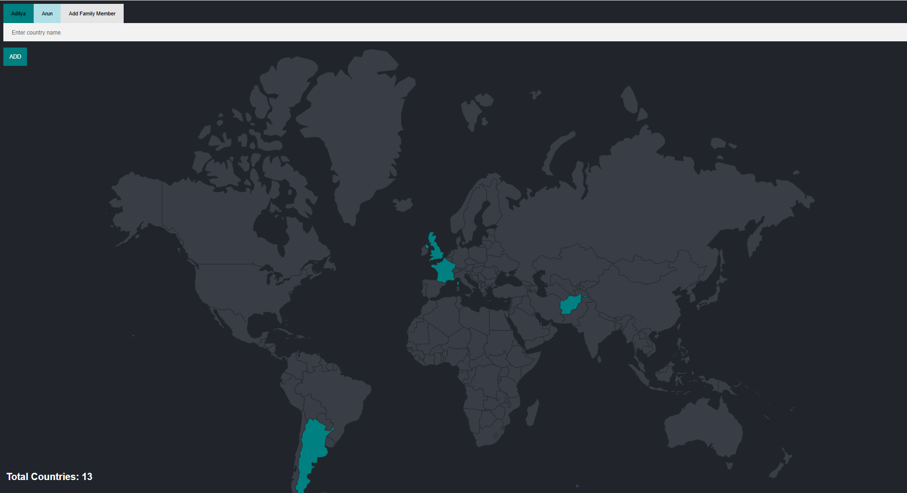

🌍 Family Travel Tracker
---
The Family Travel Tracker is a web application that allows family members to keep track of the countries they have visited. Each family member has their own profile with a custom color, and the app highlights visited countries on a shared world map. The total number of visited countries is displayed, giving families a fun and visual way to compare their journeys.

A Updated version of the travel tracker.

This project is built with Node.js, Express, PostgreSQL, and EJS templates, styled with CSS. It uses a database to store users and their visited countries, dynamically updating the map based on user input.
---
## 📷 Gallery

| Members Adding Page | Map|
|--------|--------|
|  |  |

| Map| Map|
|--------|--------|
|  |  |

---

 1️⃣ Create Table in PostgreSQL(countries visited):
 <br><br>
as given in the query.sql
 <br>
 
2️⃣ Install Dependencies:
```bash
npm i
npm i pg express ejs body-parser
```

3️⃣ Database Connection (index.js)
```bash
const app = express()
const db = new pg.Client({
  user: "postgres",
  host: "localhost",
  database: "XXXXX",    // <-- your database name
  password: "XXXXX",    // <-- your password
  port: XXXX,           // <-- your port name, by default for pg 5432
});
```
4️⃣ Run Server:
```bash
node index.js
```
---
👉 [Open App on Localhost](http://localhost:3000)
